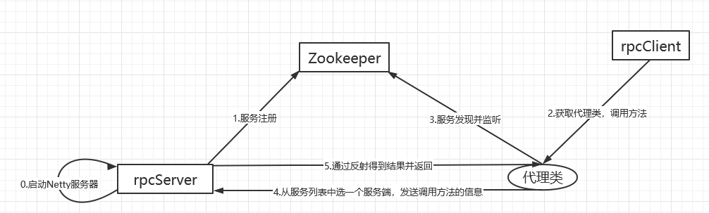
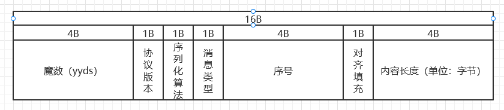

## 基于Netty+Zookeeper的分布式高性能Rpc
# 项目流程图

# 使用说明

## rpc服务端application.properites：

提供服务的接口具体的实现类
jhf.HelloService=jhf.impl.HelloServiceImpl

设置Zookeeper的地址
jhf.zookeeper.address=192.168.40.130:2181

rpc服务端提供服务的端口
jhf.rpc.server.port=8080

## rpc客户端application.properites：

选择序列化算法
jhf.rpc.client.serializer.algorithm=Json

提供如下

1. Json
2. Java

选择负载均衡算法
jhf.rpc.client.loadbalance.algorithm=RoundRobin

提供如下

1. RoundRobin--轮询算法
2. RandomRule--随机算法

# 自定义协议

协议头16B

